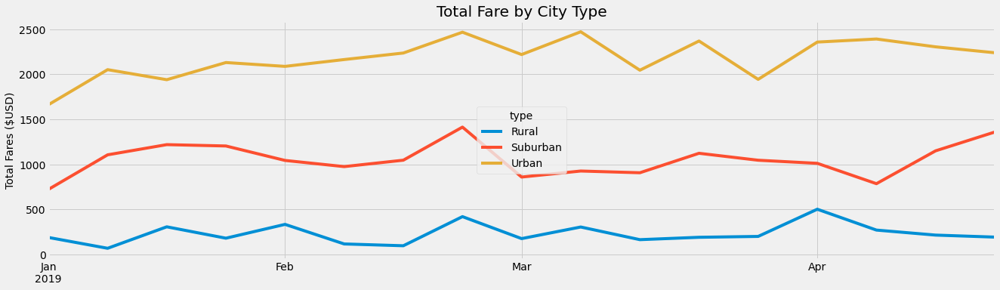
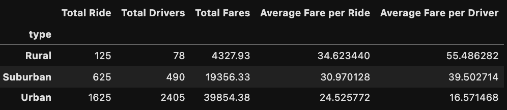

# PyBer_Analysis
## Overview
* 
 The purpose of this analysis was to investigate the different type of cities that PyBer is active in, and to see where the majority of the revenue from rides is coming frome. 

## Results

 

* 
 Here you can see that overall, the Urban cities had the most  rides, privers, and the most revenue per city by an extremely wide margin. While Urban cities were lower in Average Fare per Ride and Average Fare per Driver, this is made up for by having over 2x the amount of revenue as the 2nd highest catorgy. Total Drivers, was similarly highest in Urban, followed by suburban and rural. Total Fares also followed that patter. However, the order was reversed for Average Fare Per ride, with Rural being the highest followed by Suburban and Urban. This is due to their being 78 drivers in Rural, versus 490 in Suburban areas and 2405 in Urban areas. Average Fare per Driver also followed the pattern for the same reason. 

## Recomendation
* 
 I would recommend operations in rural environments, and allocating those drivers to Urban and Suburban areas. The revenue generated does not justify the operational costs of having those drivers in rural areas when there is an obvious demand elsewhere. 

* 
 Additionally, I would recommend shifting, or hiring more drivers to the suburban . Average Fare per Driver is well over over double in Suburban areas than in Urban areas. This might be indicitive of a high demand in the area, which we could exploit. 